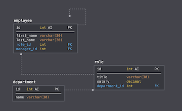

# Employee Tracker

## Description

The application is a CMS (**C**ontent **M**anagement **S**ystems) interface that views and interacts with a proposed company's stored employee information using node, inquirer, and MySQL.

The application is designed with the following database schema containing three tables:

* **department**
* **role**
* **employee**

## Installation

To use the application, the following must be installed:
* console.table: "^0.10.0",
* inquirer: "^7.3.3",
* mysql: "^2.18.1"

Run `npm install` in the terminal to install these dependencies.

## Usage

1. Create the proper database and tables for the first time by running the code in `employeeTracker.sql` in a database tool, such as **MySQL Workbench**. 
2. Create seeds to start off with by running the code within `seeds.sql` OR begin adding data independently.
3. Run `node employeeTracker.js` to begin the application.

So far, the command-line application allows users to:
* Add departments, roles, employees
* View departments, roles, employees
* Update employee roles

Thanks to **Inquirer.js** and **MySQL**, users are able route through answering questions and manage the database accordingly.
Visit [homework12-employee-tracker](https://www.youtube.com/watch?v=678qP-xyTOg&feature=youtu.be) for a video demonstration.

## Questions

If you have any questions, you can reach me through my email tpacba@live.com or connect with me on [GitHub](https://github.com/tpacba).

